# LFCP-WIRE-01: Local-First Collaboration Protocol Wire Specification

**Status:** Working Draft 0.1  
**Protocol family:** LFCP  
**Wire profile:** `LFCP-WIRE-01`  
**WebSocket subprotocol:** `lfcp-1`  
**Revision date:** 2026-10-05

> This document defines the first interoperable wire protocol for LFCP. It is intentionally narrower than the full LFCP architecture. The goal is to make it possible for two independent client implementations and two independent server implementations to exchange LFCP resources without sharing application-specific code.

### Working Draft revision policy

`LFCP-WIRE-01` is currently a mutable Working Draft. Clarifications discovered before the first Stable publication are incorporated directly into this document and tracked by Git history and release tags. Separate errata documents are reserved for already-published Stable specifications. Incompatible wire changes require a new wire profile identifier.

---

## 1. Scope

LFCP-WIRE-01 defines:

- the byte-level message envelope;
- the WebSocket transport binding;
- resource identifiers;
- principals and public key descriptors;
- signed Control Plane records;
- encrypted and signed Data Plane units;
- capability grants, revocations and invite claims;
- resource encryption epochs and key packages;
- synchronization using actor sequence ranges;
- snapshots;
- resource routing and a per-resource Control Coordinator;
- ownership transfer;
- normal migration between independent LFCP servers;
- connection and resource state machines;
- error handling;
- minimum conformance requirements.

LFCP-WIRE-01 does **not** define:

- Markdown syntax;
- Obsidian integration;
- VS Code integration;
- the semantics of tasks, documents, comments or other application objects;
- the internal CRDT algorithm;
- attachments or arbitrary large blob transport;
- human-readable contact discovery;
- account recovery;
- multi-owner or quorum governance;
- a global LFCP account service.

Application data is opaque to the LFCP server.

---

## 2. Normative language

The key words **MUST**, **MUST NOT**, **REQUIRED**, **SHALL**, **SHALL NOT**, **SHOULD**, **SHOULD NOT**, **RECOMMENDED**, **NOT RECOMMENDED**, **MAY**, and **OPTIONAL** are to be interpreted as described in BCP 14 when, and only when, they appear in all capitals.

---

## 3. Design invariants

The following invariants are fundamental to LFCP-WIRE-01.

### 3.1 Resource identity is independent of hosting

```text
Resource ID != Server ID != Owner ID != Filename
```

Moving a resource between servers MUST NOT change the Resource ID.

### 3.2 Data Plane and Control Plane are separate

```text
DATA PLANE
CRDT/application updates
multi-writer
mergeable
normally encrypted

CONTROL PLANE
ownership
capabilities
key epochs
routing
serialized per resource
```

The Data Plane is designed for concurrent multi-writer operation.

The Control Plane is intentionally serialized in LFCP-WIRE-01 because ownership, revocation, key rotation and one-time invitation claims require deterministic ordering.

### 3.3 The server is not the root of trust

A server MAY enforce transport-level access and hosting policy, but a client MUST independently verify persistent authorization and signatures.

### 3.4 Application state is opaque to the server

The server MUST NOT need to understand Automerge, Yjs, Markdown, tasks or any other application-specific data format.

### 3.5 Offline operation is normal

A client MAY create Data Units while disconnected.

Control Plane changes normally require communication with the resource Control Coordinator. This is an intentional tradeoff: collaboration data remains highly available while security-sensitive mutations remain serializable.

---

## 4. Referenced standards

LFCP-WIRE-01 relies on existing cryptographic and encoding standards rather than defining new primitives.

- RFC 6455: WebSocket
- RFC 8949: CBOR
- RFC 8610: CDDL
- RFC 9052 / RFC 9053: COSE
- RFC 8032: Ed25519
- RFC 7748: X25519
- RFC 5869: HKDF
- RFC 8439: ChaCha20-Poly1305
- RFC 9180: HPKE

Implementations MUST use well-reviewed implementations of these primitives.

---

# Part I. Core Types

## 5. Binary conventions

### 5.1 Integer encoding

All integers are ordinary CBOR unsigned or negative integers.

Where an integer is converted to raw bytes for a KDF or nonce, LFCP uses unsigned big-endian encoding.

### 5.2 Deterministic CBOR

All LFCP-owned structures whose exact bytes are hashed, signed, used as AEAD AAD, used as HPKE `info`, used as HPKE AAD, or otherwise compared byte-for-byte MUST use the deterministic encoding rules defined in this section.

LFCP-WIRE-01 uses the RFC 8949 deterministic encoding requirements with preferred serialization.

A conforming LFCP encoder MUST:

1. use the shortest permitted CBOR encoding for integers and lengths;
2. use definite-length arrays, maps, byte strings, and text strings;
3. reject or avoid duplicate map keys;
4. order map keys according to deterministic CBOR ordering: first by the length of each key's deterministic CBOR encoding, then by bytewise lexical order of that encoding;
5. preserve array order exactly where an LFCP schema defines an array;
6. emit CBOR tags only where LFCP explicitly requires them;
7. not add semantically redundant fields whose presence changes deterministic bytes.

For protocol-owned maps, LFCP normally uses small unsigned integer keys.

Where an LFCP field is optional, omitting the field and encoding the field with an empty value are distinct byte representations. Individual LFCP schemas MAY require one representation as canonical. Such requirements are normative.

A verifier receiving a signed object verifies the exact received bytes. It MUST NOT decode and re-encode an object before signature verification or object-ID calculation.

When an LFCP algorithm requires reconstructing a deterministic structure, such as AEAD AAD, HPKE `info`, or HPKE AAD, the reconstructed structure MUST follow these deterministic CBOR rules exactly.

### 5.3 Hash

`hash32` means SHA-256 and is encoded as a 32-byte CBOR byte string.

```text
hash32(x) = SHA-256(x)
```

### 5.4 Random identifiers

Random identifiers MUST be generated using a cryptographically secure random number generator.

---

## 6. Resource ID

A Resource ID is 32 random bytes.

```cddl
resource-id = bstr .size 32
```

Resource IDs are generated locally and MUST NOT encode:

- a server hostname;
- an owner identity;
- an account identifier;
- a path;
- a timestamp.

A user-facing textual representation is outside the wire format. Implementations SHOULD display a short checksum-protected representation rather than raw hexadecimal.

---

## 7. Principal

LFCP-WIRE-01 uses an operational **Principal** as its cryptographic identity primitive.

A Principal contains:

- one Ed25519 signing public key;
- one X25519 key-agreement public key;
- a deterministic Principal ID.

```cddl
principal-id = bstr .size 32
ed25519-public-key = bstr .size 32
x25519-public-key = bstr .size 32

principal-descriptor = {
  0 => principal-id,
  1 => ed25519-public-key,
  2 => x25519-public-key
}
```

The Principal ID is:

```text
principal_id = SHA-256(
    ASCII("LFCP-PRINCIPAL-v1") ||
    ed25519_public_key ||
    x25519_public_key
)
```

A verifier MUST recompute the ID whenever a descriptor is received.

### 7.1 Principal and human identity

LFCP-WIRE-01 deliberately does not require a global human identity system.

A Principal may represent:

- a person;
- a device;
- a service;
- an ephemeral invitation capability;
- a dedicated offline owner key.

A single human MAY possess multiple Principals.

Applications SHOULD normally use a distinct operational Principal per independently editing device, because Data Plane sequence numbers are scoped to a Principal.

A future LFCP extension may define explicit root-identity-to-device delegation. It is not required by WIRE-01.

---

## 8. Sequence numbers

Every writing Principal maintains a monotonically increasing sequence number **per Resource**.

```text
(resource, principal) -> next_seq
```

Sequence numbers begin at `1`.

A Principal MUST NOT create two different Data Units with the same `(resource_id, principal_id, seq)` tuple.

If an implementation loses its sequence state and cannot safely reconstruct it, it MUST generate a new Principal for future writes to that Resource.

---

# Part II. Cryptographic Profile

## 9. LFCP crypto profile v1

LFCP-WIRE-01 fixes the following profile for interoperability:

| Purpose | Algorithm |
|---|---|
| Persistent signatures | Ed25519 |
| Hash | SHA-256 |
| KDF | HKDF-SHA256 |
| Data encryption | ChaCha20-Poly1305 |
| Recipient key transport | HPKE |
| HPKE KEM | DHKEM(X25519, HKDF-SHA256) |
| HPKE KDF | HKDF-SHA256 |
| HPKE AEAD | ChaCha20-Poly1305 |
| Signed object container | COSE_Sign1 |
| Structured encoding | Deterministic CBOR |

An implementation claiming LFCP-WIRE-01 conformance MUST support this profile.

---

## 10. COSE_Sign1 rules

Persistent LFCP signed objects use one canonical untagged `COSE_Sign1` representation.

LFCP-WIRE-01 MUST encode a signed object as the bare four-element COSE_Sign1 array. The CBOR tag for `COSE_Sign1`, tag number `18`, MUST NOT be emitted.

Conceptually:

```cddl
lfcp-cose-sign1 = [
  protected   : bstr,
  unprotected : {},
  payload     : bstr,
  signature   : bstr .size 64
]
```

The object is encoded as a CBOR array, not as:

```text
18([ protected, unprotected, payload, signature ])
```

A strict LFCP-WIRE-01 implementation MUST reject a tagged persistent LFCP object as non-canonical.

Because LFCP-WIRE-01 is still a Working Draft, no compatibility with pre-consolidation experimental tagged objects is required. An implementation MAY offer an explicit import tool for such data, but imported objects MUST retain their exact received bytes until deliberately migrated.

### 10.1 Protected header

The protected header is a CBOR byte string containing the deterministic CBOR encoding of exactly this map:

```cddl
lfcp-protected-header = {
  1 => -8,             ; alg = EdDSA
  4 => principal-id    ; kid = signing Principal ID
}
```

No additional protected header parameters are permitted in LFCP-WIRE-01.

The value of `kid` MUST be the 32-byte Principal ID of the signing Principal.

### 10.2 Unprotected header

The unprotected header MUST be the empty CBOR map:

```cddl
{}
```

This requirement ensures that two conforming implementations do not create different persistent object bytes for the same LFCP signed payload by adding unsigned metadata.

### 10.3 Payload

The COSE payload MUST be present and MUST be a CBOR byte string.

Detached payloads are not permitted in LFCP-WIRE-01.

For LFCP records whose payload is an LFCP CBOR structure, the byte string MUST contain the deterministic CBOR encoding of that structure.

### 10.4 External AAD

COSE external AAD MUST be the zero-length byte string:

```text
external_aad = h''
```

### 10.5 Signature input

The Ed25519 signature MUST be computed according to COSE over the standard `Sig_structure`:

```cddl
[
  "Signature1",
  protected,       ; exact protected-header bstr from the object
  h'',             ; empty external AAD
  payload          ; exact payload bstr from the object
]
```

The `Sig_structure` itself MUST be encoded using the deterministic CBOR rules in Section 5.2.

The signature is the 64-byte Ed25519 signature over the encoded `Sig_structure`.

### 10.6 Exact bytes and object IDs

When LFCP transmits a signed object inside another LFCP message, it transmits the **exact canonical untagged COSE_Sign1 bytes** as a CBOR byte string.

The object ID is:

```text
object_id = SHA-256(exact_COSE_Sign1_bytes)
```

Re-encoding a signed object is prohibited because doing so can change its object ID.

Two semantically equivalent but byte-different COSE objects are different LFCP objects.

### 10.7 Canonical COSE summary

A canonical LFCP signed object has exactly this shape:

```text
[
  h'<deterministic CBOR {1:-8, 4:principal_id}>',
  {},
  h'<deterministic LFCP payload CBOR>',
  h'<64-byte Ed25519 signature>'
]
```

with no enclosing CBOR tag.

---

## 11. Resource Data Encryption Key

Each Resource has a 32-byte Data Encryption Key, DEK, for each Data Epoch.

```cddl
dek = bstr .size 32
```

The DEK MUST be generated randomly.

For epoch `E`, the public commitment is:

```text
dek_commitment = SHA-256(
    ASCII("LFCP-DEK-v1") ||
    resource_id ||
    uint64_be(E) ||
    DEK
)
```

The commitment is stored in the Control Plane.

The DEK itself is never stored in plaintext on the synchronization server.

---

## 12. Per-actor Data Plane encryption

To avoid nonce reuse while allowing a single Resource DEK to serve many writers, LFCP derives an actor-specific key.

For Resource `R`, Data Epoch `E`, Principal `A` and DEK `K`:

```text
salt = R || uint64_be(E)

prk = HKDF-Extract(
    salt = salt,
    IKM = K
)

actor_key = HKDF-Expand(
    PRK = prk,
    info = ASCII("LFCP-DATA-KEY-v1") || A,
    L = 32
)
```

The ChaCha20-Poly1305 nonce is:

```text
nonce = 0x00000000 || uint64_be(seq)
```

Because each Principal has a different derived key, the same sequence number may safely exist for different Principals.

Reusing the same sequence number for the same Principal and Resource is forbidden.

---

# Part III. Control Plane

## 13. Control chain

Every Resource has a linear Control Chain.

```text
Genesis
   |
   v
Control #1
   |
   v
Control #2
   |
   v
...
```

Each Control Record contains:

- the Resource ID;
- a monotonically increasing Control Sequence;
- the previous Control Record ID;
- a Control Record type;
- the issuing Principal;
- a type-specific body.

```cddl
control-record-payload = {
  0 => resource-id,
  1 => uint,                  ; control_seq
  2 => (hash32 / null),       ; prev_control_id
  3 => uint,                  ; control_type
  4 => principal-id,          ; issuer
  5 => any                    ; body
}
```

The payload is signed with COSE_Sign1.

The resulting record ID is the SHA-256 hash of the exact COSE bytes.

### 13.1 Control sequence

Genesis has:

```text
control_seq = 0
prev_control_id = null
```

Every subsequent valid Control Record MUST have:

```text
control_seq = previous.control_seq + 1
prev_control_id = previous.record_id
```

### 13.2 Forks

Two different validly signed records referencing the same previous Control Record create a Control Fork.

```text
           C42
          /   \
       C43a   C43b
```

A client MUST NOT silently choose a branch.

The Resource enters `CONTROL_CONFLICT` until the owner explicitly resolves the fork using a future recovery procedure or an implementation-specific administrative procedure.

Normal operation uses a Control Coordinator to prevent accidental forks.

---

## 14. Control Record type registry

| Code | Name |
|---:|---|
| 0 | `GENESIS` |
| 1 | `CAPABILITY_GRANT` |
| 2 | `CAPABILITY_REVOKE` |
| 3 | `CAPABILITY_CLAIM` |
| 4 | `KEY_EPOCH` |
| 5 | `ROUTE_UPDATE` |
| 6 | `OWNER_TRANSFER_COMMIT` |
| 7 | `COORDINATOR_RECOVERY` |
| 8 | `RESOURCE_TOMBSTONE` |
| 9-31 | Reserved for LFCP core |
| 32+ | Extension space |

Unknown core Control Record types MUST cause validation failure.

Unknown extension types MAY be retained but MUST NOT be interpreted unless the implementation declares support for the extension.

---

## 15. Genesis Record

Genesis establishes:

- Resource ID;
- Data Profile;
- initial owner;
- Data Epoch `0`;
- initial DEK commitment;
- initial route set;
- initial Control Coordinator.

```cddl
genesis-body = {
  0 => tstr,                  ; data_profile, e.g. "lfcp.automerge.v1"
  1 => principal-descriptor,  ; owner
  2 => hash32,                ; epoch-0 DEK commitment
  3 => [1* endpoint],         ; initial sync endpoints
  4 => tstr                   ; initial Control Coordinator URL
}
```

The Genesis Record MUST be signed by the owner Principal contained in the body.

The owner Principal has implicit authority over the Resource and does not require an explicit Capability Grant.

---

## 16. Endpoint

```cddl
endpoint = {
  0 => tstr,          ; absolute wss:// URL
  1 => uint,          ; priority; lower is preferred
  ? 2 => uint         ; flags
}
```

LFCP-WIRE-01 defines these endpoint flags:

| Bit | Meaning |
|---:|---|
| 0 | Supports Data Plane storage |
| 1 | Supports Control Plane storage |
| 2 | Supports snapshots |
| 3 | Supports presence |
| 4 | Preferred for reads |
| 5 | Preferred for writes |

All other bits are reserved.

For non-loopback network communication, endpoints MUST use `wss://`.

`ws://` MAY be used for local development or loopback-only deployments.

---

## 17. Capability model

Capabilities are established by Control Records.

### 17.1 Standard ability codes

| Code | Ability |
|---:|---|
| 1 | `data/read` |
| 2 | `data/write` |
| 3 | `snapshot/publish` |
| 4 | `capability/grant` |
| 5 | `capability/revoke` |
| 6 | `key/distribute` |
| 7 | `key/rotate` |
| 8 | `route/update` |
| 9 | `owner/transfer-offer` |
| 10 | `resource/tombstone` |
| 11 | `invite/claim` |

The owner implicitly has all standard abilities.

### 17.2 Capability Grant

```cddl
capability-grant-body = {
  0 => principal-descriptor,  ; subject
  1 => [1* uint],             ; abilities
  2 => [* uint],              ; delegable abilities
  ? 3 => hash32,              ; parent grant id
  ? 4 => uint                 ; claim_limit; only for invite principals
}
```

A non-owner issuer MUST prove authority to grant every requested ability.

If `parent grant id` is present:

- the parent grant MUST be active;
- the issuer MUST be the subject of the parent grant;
- every granted ability MUST be included in the parent's delegable abilities.

A capability grant is identified by the Control Record ID that created it.

### 17.3 Capability Revocation

```cddl
capability-revoke-body = {
  0 => hash32                 ; grant id
}
```

The issuer MUST either:

- be the Resource owner; or
- possess `capability/revoke` authority that covers the target grant.

Revocation does not make recipients forget data they already decrypted.

For security-sensitive removal, the owner SHOULD also rotate the Data Epoch.

---

## 18. Invitation Principal and Capability Claim

LFCP link invitations are implemented without a global account service.

The inviter generates an ephemeral Principal called the **Invitation Principal**.

The owner then creates a Capability Grant to that Principal.

A typical invite grant contains:

```text
data/read
data/write
invite/claim

claim_limit = 1
```

The inviter also publishes a Key Package containing the current DEK encrypted to the Invitation Principal.

The invitation URI carries the Invitation Principal private key material in its secret fragment.

### 18.1 Claim Record

The recipient creates or loads its normal Principal and submits a `CAPABILITY_CLAIM` Control Record signed by the Invitation Principal.

```cddl
capability-claim-body = {
  0 => hash32,                ; invitation grant id
  1 => principal-descriptor,  ; claimant
  2 => [1* uint]              ; abilities to transfer
}
```

Validation rules:

1. the Invitation Grant MUST be active;
2. it MUST grant `invite/claim`;
3. its `claim_limit` MUST be greater than zero;
4. the requested abilities MUST be a subset of the Invitation Grant abilities excluding `invite/claim` unless explicitly delegated;
5. the claim issuer MUST be the Invitation Principal;
6. the Control Coordinator MUST serialize claims for the same invitation grant.

A successful claim:

- creates a new capability grant to the claimant;
- consumes one claim from the Invitation Grant;
- when the limit reaches zero, the Invitation Grant is no longer usable for further claims.

For `claim_limit = 1`, only one claimant can win at the Control Coordinator.

### 18.2 Canonical invitation URI

WIRE-01 defines a portable custom URI for invitation handoff.

Resource IDs and Control Record IDs are encoded using unpadded Base64url when placed in a URI. Endpoint values use ordinary URI percent-encoding.

A targeted invitation has the form:

```text
lfcp://join/<resource-b64url>?endpoint=<escaped-wss-url>&grant=<grant-id-b64url>
```

A bearer/link invitation additionally contains an Invitation Principal secret in the URI fragment:

```text
lfcp://join/<resource-b64url>?endpoint=<escaped-wss-url>&grant=<grant-id-b64url>#secret=<secret-b64url>
```

Multiple `endpoint` query parameters MAY be present.

The decoded bearer secret is deterministic CBOR:

```cddl
invite-secret = {
  0 => 1,                     ; secret format version
  1 => bstr .size 32,         ; Invitation Principal Ed25519 private seed
  2 => bstr .size 32          ; Invitation Principal X25519 private key
}
```

The receiving client MUST recompute the corresponding public Principal Descriptor and MUST verify that it matches the subject of the referenced Invitation Grant before using the secret.

The fragment secret MUST NOT be logged, placed in analytics, stored in browser history by an LFCP web landing page, or transmitted to the synchronization server as an opaque URL.

A native LFCP client SHOULD register the `lfcp:` custom scheme. A QR code MAY contain the same URI.

A web-based invite landing page requires additional care because page JavaScript can read URL fragments; such a flow is outside WIRE-01 and MUST NOT be assumed to preserve the secret from the web origin.

### 18.3 Partition caveat

Exactly-once claiming is a coordination problem.

If two independent servers both accept Control Plane writes while partitioned, they can create competing claims.

Therefore, one-time invitation semantics are guaranteed only when all claim operations are serialized through the current Control Coordinator.

---

## 19. Key Epoch Record

A Data Epoch rotation creates a new DEK and deterministically closes the previous epoch.

```cddl
key-epoch-body = {
  0 => uint,                  ; new epoch number
  1 => hash32,                ; new DEK commitment
  2 => [* actor-have],        ; accepted final frontier of previous epoch
  3 => uint                   ; reason code
}
```

Reason codes:

| Code | Meaning |
|---:|---|
| 0 | Routine rotation |
| 1 | Member revoked |
| 2 | Principal/device compromise |
| 3 | Ownership transfer |
| 4 | Manual security rotation |

The new epoch number MUST be exactly the previous Data Epoch plus one.

The issuer MUST possess `key/rotate`.

### 19.1 Previous-epoch cutoff

After a Key Epoch Record is committed, a Data Unit belonging to the previous epoch is automatically acceptable only if its actor sequence is within the recorded final frontier.

If an actor is absent from the recorded frontier, no newly discovered Data Units from that actor in the closed epoch are automatically acceptable.

Any later-arriving previous-epoch unit beyond that frontier MUST NOT be merged automatically.

It SHOULD be surfaced to the application as stale offline work that may be manually reviewed and re-applied.

This rule makes strict revocation deterministic across replicas.

---

## 20. Route Update Record

```cddl
route-update-body = {
  0 => uint,          ; route version
  1 => [1* endpoint],
  2 => tstr           ; Control Coordinator URL
}
```

The route version MUST increase monotonically.

The Control Coordinator URL SHOULD name one of the listed endpoints.

The issuer MUST possess `route/update`.

The update becomes authoritative only after it is committed to the Control Chain.

---

## 21. Control Coordinator

Each Resource has one current Control Coordinator URL.

The Control Coordinator serializes mutations to the Control Chain using compare-and-swap semantics on the current Control Head.

It does **not** serialize Data Plane writes.

```text
                    Control Plane
                         |
                  one coordinator
                         |
                         v
                    linear chain

                    Data Plane
                /        |        \
             peer A    peer B    peer C
                 concurrent CRDT updates
```

A server that is not the current Control Coordinator MUST reject ordinary `CONTROL_PUT` requests with `NOT_CONTROL_COORDINATOR` and SHOULD return the currently known coordinator URL.

### 21.1 Why the coordinator exists

The coordinator provides deterministic ordering for:

- one-time invitation claims;
- capability mutation;
- key rotation;
- route mutation;
- ownership transfer.

The coordinator is replaceable and does not own the Resource.

---

## 22. Coordinator Recovery

A dead Control Coordinator must not permanently strand a Resource.

`COORDINATOR_RECOVERY` is an owner-only emergency Control Record.

```cddl
coordinator-recovery-body = {
  0 => uint,          ; new route version
  1 => [1* endpoint],
  2 => tstr,          ; new coordinator URL
  3 => tstr           ; human-readable reason; max 256 UTF-8 bytes
}
```

A non-coordinator server MAY accept this record if:

- it is signed by the current owner;
- it references that server's current known Control Head;
- all normal chain rules hold.

This recovery mechanism restores liveness but cannot mathematically prevent a fork if different disconnected replicas possess different Control Heads.

Clients MUST detect such a fork rather than silently resolving it.

---

## 23. Ownership transfer

Ownership transfer uses an offer, an acceptance, and one committed Control Record.

### 23.1 Transfer Offer

The current owner creates a standalone signed object:

```cddl
owner-transfer-offer-payload = {
  0 => resource-id,
  1 => hash32,                ; current Control Head
  2 => uint,                  ; expected next Control Sequence
  3 => principal-descriptor,  ; proposed new owner
  4 => bstr .size 16          ; nonce
}
```

The offer is signed by the current owner using COSE_Sign1.

### 23.2 Transfer Accept

The proposed new owner signs:

```cddl
owner-transfer-accept-payload = {
  0 => resource-id,
  1 => hash32,                ; transfer offer id
  2 => principal-id           ; accepting new owner id
}
```

### 23.3 Transfer Commit

The new owner submits a Control Record of type `OWNER_TRANSFER_COMMIT` signed by the new owner.

```cddl
owner-transfer-commit-body = {
  0 => bstr,                  ; exact COSE bytes of transfer offer
  1 => bstr                   ; exact COSE bytes of transfer accept
}
```

A verifier MUST confirm:

1. the offer is signed by the current owner;
2. the offer references the current Control Head;
3. the offer names the accepting Principal;
4. the acceptance is signed by that Principal;
5. the commit itself is signed by that Principal;
6. the expected next Control Sequence matches the commit sequence.

After commit, the accepting Principal becomes the Resource owner.

A key rotation is RECOMMENDED immediately after ownership transfer and REQUIRED if the previous owner is being removed from future access.

---

## 24. Resource Tombstone

A Resource may be logically deleted through `RESOURCE_TOMBSTONE`.

```cddl
resource-tombstone-body = {
  0 => uint,          ; reason code
  ? 1 => tstr         ; optional note; max 256 UTF-8 bytes
}
```

The issuer MUST possess `resource/tombstone`.

A tombstone does not force independent peers to erase local copies.

It only states that the Resource should no longer accept normal future mutations under this Control Chain.

---

# Part IV. Key Packages

## 25. Key Package

A Key Package delivers a Resource DEK to an authorized Principal using HPKE.

The payload is signed with COSE_Sign1.

```cddl
key-package-payload = {
  0 => resource-id,
  1 => uint,                  ; data epoch
  2 => principal-id,          ; recipient
  3 => hash32,                ; Control Head used for authorization
  4 => principal-id,          ; sender
  5 => bstr,                  ; HPKE enc
  6 => bstr                   ; HPKE ciphertext
}
```

### 25.1 HPKE info

The HPKE `info` value is deterministic CBOR encoding of:

```cddl
[
  "LFCP-KEY-v1",
  resource-id,
  uint,          ; data epoch
  principal-id   ; recipient
]
```

The HPKE plaintext is exactly the 32-byte DEK.

The HPKE AAD is deterministic CBOR encoding of:

```cddl
[
  resource-id,
  uint,          ; data epoch
  hash32         ; Control Head
]
```

### 25.2 Key Package validation

After decryption, the recipient MUST verify the DEK against the `dek_commitment` for that epoch.

The package signer MUST have had `key/distribute` authority at the referenced Control Head.

The recipient MUST have had `data/read` authority at that Control Head, except for an Invitation Principal explicitly authorized by an active invite grant.

A server MAY store multiple Key Packages for the same `(resource, epoch, recipient)` tuple.

Clients accept any cryptographically valid package that yields the correct DEK commitment.

---

# Part V. Data Plane

## 26. Data Unit

A Data Unit is the immutable, encrypted, signed unit of LFCP application replication.

Its plaintext is defined by the Resource Data Profile.

Examples of plaintexts include:

- one or more Automerge changes;
- one Yjs update;
- one application-specific CRDT operation batch.

The Data Unit payload is:

```cddl
data-unit-payload = {
  0 => resource-id,
  1 => uint,                  ; data epoch
  2 => principal-id,          ; actor
  3 => uint,                  ; actor sequence
  4 => (hash32 / null),       ; previous Data Unit by this actor
  5 => hash32,                ; Control Head observed by actor
  6 => bstr                   ; ciphertext + AEAD tag
}
```

The payload is signed by the actor using COSE_Sign1.

The Data Unit ID is the SHA-256 hash of the exact COSE bytes.

### 26.1 AAD

The ChaCha20-Poly1305 AAD is deterministic CBOR encoding of:

```cddl
[
  "LFCP-DATA-v1",
  resource-id,
  uint,                  ; data epoch
  principal-id,
  uint,                  ; actor sequence
  (hash32 / null),       ; previous actor unit
  hash32                 ; Control Head
]
```

### 26.2 Actor hash chain

For sequence `N > 1`, `previous Data Unit` SHOULD identify sequence `N-1` from the same actor and Resource.

For sequence `1`, it MUST be `null`.

A gap or mismatch MUST be reported to the sync engine.

If two differently hashed valid signatures exist for the same `(resource, actor, seq)`, the actor has equivocated.

The client MUST NOT silently choose one.

### 26.3 Authorization

A Data Unit is eligible for merge only if:

1. its signature is valid for the actor Principal;
2. the actor possessed `data/write` at the referenced Control Head;
3. the referenced Control Head belongs to the valid Control Chain;
4. the Data Epoch is recognized;
5. if the epoch has since been closed, the unit is within the epoch cutoff frontier;
6. the unit decrypts successfully;
7. the Data Profile accepts the plaintext.

---

## 27. Data Profile

Genesis contains a profile identifier such as:

```text
lfcp.automerge.v1
lfcp.yjs.v1
lfcp.tasks.v1
```

LFCP-WIRE-01 treats the decrypted Data Unit plaintext as an opaque byte string.

The selected profile defines:

- plaintext format;
- merge algorithm;
- dependency semantics;
- snapshot plaintext format;
- profile-specific validation.

A synchronization server MUST NOT need the profile implementation.

---

## 28. Have Vector

A replica describes its Data Plane holdings with Actor Have entries.

```cddl
actor-have = {
  0 => principal-id,
  1 => uint,                   ; highest contiguous sequence
  ? 2 => [* sequence-range]    ; extra received ranges above contiguous
}

sequence-range = [
  uint,                        ; inclusive start
  uint                         ; inclusive end
]
```

Example:

```text
actor A:
1..100 present
105..107 present
```

is encoded conceptually as:

```text
contiguous = 100
extras = [[105, 107]]
```

Ranges MUST be normalized:

- sorted ascending;
- non-overlapping;
- non-adjacent;
- strictly above `contiguous`.

A missing range is inferred from the difference between two peers' Have Vectors.

### 28.1 Canonical Actor Have

Whenever an `actor-have` value is used inside a persistent LFCP object or cryptographic input, its canonical representation MUST satisfy all of the following rules:

1. keys `0` and `1` MUST be present;
2. key `2` MUST be omitted when there are no extra ranges;
3. key `2` MUST be present when there is at least one extra range;
4. each sequence range MUST have `start <= end`;
5. ranges MUST be strictly above `contiguous`;
6. ranges MUST be sorted by ascending `start`, then ascending `end`;
7. ranges MUST be non-overlapping;
8. ranges MUST be non-adjacent;
9. no two `actor-have` entries for the same Principal MAY occur in one canonical frontier.

Thus the following two representations are not both canonical:

```cbor-diag
{0: h'...', 1: 7}
{0: h'...', 1: 7, 2: []}
```

Only the first form is canonical when no extra ranges exist.

### 28.2 Canonical Frontier

A **canonical frontier** is an array of canonical `actor-have` maps:

```cddl
canonical-frontier = [* actor-have]
```

Entries MUST be sorted by ascending raw 32-byte `principal-id`, compared lexicographically as unsigned bytes.

The empty frontier is encoded as the empty CBOR array.

Any Snapshot publisher MUST canonicalize the frontier before encrypting or signing a Snapshot.

A Snapshot verifier MUST reject a Snapshot whose frontier is not canonical.

This sorting rule applies to the Snapshot frontier. It does not require live `DATA_HAVE` messages to be transmitted in that order unless another LFCP section explicitly requires it.

---

# Part VI. Snapshots

## 29. Snapshot

A Snapshot is an encrypted, signed materialization of profile state at a known Data frontier.

```cddl
snapshot-payload = {
  0 => resource-id,
  1 => uint,                  ; data epoch
  2 => principal-id,          ; publisher
  3 => uint,                  ; publisher snapshot sequence
  4 => hash32,                ; Control Head
  5 => canonical-frontier,    ; included frontier
  6 => bstr                   ; ciphertext || AEAD tag
}
```

The Snapshot is signed by the publisher using the canonical untagged `COSE_Sign1` representation defined by Section 10.

The Snapshot ID is:

```text
snapshot_id = SHA-256(exact_COSE_Sign1_bytes)
```

The publisher Snapshot Sequence MUST NOT be reused for the same `(resource, data_epoch, publisher)` tuple.

A publisher SHOULD monotonically increase it.

For the v1 Snapshot nonce construction, `snapshot_sequence` MUST fit in an unsigned 64-bit integer.

The Snapshot frontier in field `5` MUST be canonical according to Sections 28.1 and 28.2.

### 29.1 Snapshot encryption

#### 29.1.1 Snapshot encryption key

The Snapshot encryption key is derived from the Resource DEK for the Snapshot's Data Epoch.

```text
salt = resource_id || uint64_be(data_epoch)

prk = HKDF-Extract(salt, DEK)

snapshot_key = HKDF-Expand(
    prk,
    ASCII("LFCP-SNAPSHOT-KEY-v1") || publisher_principal_id,
    32
)
```

For this construction, `data_epoch` MUST fit in an unsigned 64-bit integer.

#### 29.1.2 Nonce

The ChaCha20-Poly1305 nonce is exactly 12 bytes:

```text
snapshot_nonce = 0x00000000 || uint64_be(snapshot_sequence)
```

The same `(snapshot_key, snapshot_nonce)` pair MUST NOT be reused with different plaintext.

The rule prohibiting reuse of Snapshot Sequence for the same `(resource, data_epoch, publisher)` tuple is therefore cryptographically significant.

#### 29.1.3 Exact Snapshot AAD

Snapshot AAD is the deterministic CBOR encoding of exactly this seven-element array:

```cddl
snapshot-aad = [
  "LFCP-SNAPSHOT-v1",
  resource-id,
  uint,                  ; data epoch
  principal-id,          ; publisher
  uint,                  ; publisher snapshot sequence
  hash32,                ; Control Head
  canonical-frontier     ; included frontier
]
```

There is no map wrapper and no additional prefix outside the array.

The first array element is the UTF-8 text string:

```text
LFCP-SNAPSHOT-v1
```

The remaining six elements MUST equal Snapshot payload fields `0` through `5` in the same order.

Snapshot payload field `6`, the ciphertext, is not included in AAD.

No Snapshot ID, COSE header, signature, route, profile identifier, or server identifier is included in Snapshot AAD unless a future LFCP profile explicitly defines a new Snapshot format version.

The AAD bytes are therefore:

```text
snapshot_aad_bytes = deterministic_cbor([
    "LFCP-SNAPSHOT-v1",
    resource_id,
    data_epoch,
    publisher_principal_id,
    snapshot_sequence,
    control_head,
    canonical_frontier
])
```

#### 29.1.4 Encryption operation

Let `snapshot_plaintext` be the exact byte string produced by the selected LFCP Data Profile for Snapshot state.

The encrypted Snapshot payload is:

```text
ciphertext_and_tag = ChaCha20Poly1305.Seal(
    key       = snapshot_key,
    nonce     = snapshot_nonce,
    plaintext = snapshot_plaintext,
    aad       = snapshot_aad_bytes
)
```

The result includes the 16-byte Poly1305 authentication tag and is stored directly in Snapshot payload field `6`.

Decryption is the inverse operation:

```text
snapshot_plaintext = ChaCha20Poly1305.Open(
    key        = snapshot_key,
    nonce      = snapshot_nonce,
    ciphertext = snapshot_payload[6],
    aad        = snapshot_aad_bytes
)
```

A verifier MUST reconstruct the canonical frontier and exact AAD and MUST reject the Snapshot if AEAD authentication fails.

A verifier MUST NOT attempt alternate AAD layouts.

#### 29.1.5 Example shape

For illustration only, not as a test vector:

```cbor-diag
[
  "LFCP-SNAPSHOT-v1",
  h'<32-byte resource id>',
  4,
  h'<32-byte publisher principal id>',
  12,
  h'<32-byte control head>',
  [
    {0: h'<actor A>', 1: 18},
    {0: h'<actor B>', 1: 7, 2: [[9, 10]]}
  ]
]
```

Actor entries in the final array MUST appear in raw `principal-id` byte order, not display-name order, insertion order, arrival order, or server order.

### 29.2 Publishing authority

The publisher MUST have `snapshot/publish` at the referenced Control Head.

A Snapshot never establishes authorization, ownership or routing.

It is only a Data Plane optimization.

---

# Part VII. WebSocket Transport

## 30. Endpoint

The reference WebSocket endpoint is:

```text
/v1/ws
```

A server MAY expose LFCP at another path if its Route Manifest contains the complete absolute URL.

The WebSocket subprotocol is:

```text
lfcp-1
```

Clients MUST request this subprotocol.

Servers MUST reject a session if no supported LFCP subprotocol is negotiated.

---

## 31. WebSocket message rules

- LFCP uses binary WebSocket messages only.
- One complete LFCP message is carried in one WebSocket message.
- WebSocket fragmentation MAY be used by the transport implementation.
- A receiver MUST treat a text WebSocket message as a protocol error.
- A receiver MUST reject malformed CBOR.
- A receiver MUST enforce its advertised maximum message size.

The default maximum LFCP message size is **8 MiB** unless the server advertises another value in `READY`.

Attachments and arbitrary large blob transfer are outside LFCP-WIRE-01.

---

## 32. LFCP message envelope

Every WebSocket message contains one deterministic CBOR map.

```cddl
lfcp-message = {
  0 => uint,                  ; message type
  1 => bstr .size 16,        ; message id
  ? 2 => bstr .size 16,      ; correlation id
  ? 3 => uint,               ; flags; currently 0
  4 => any                    ; message body
}
```

Message IDs are random 128-bit values generated per message.

A response SHOULD set `correlation id` to the request's Message ID.

Message IDs are transport correlation values and are not security identifiers.

Unknown envelope fields with integer keys greater than `15` MAY be ignored.

Unknown envelope fields from `0` through `15` MUST cause `MALFORMED_MESSAGE` unless a later negotiated version defines them.

---

## 33. Message type registry

### 33.1 Session

| Code | Name |
|---:|---|
| 0 | `HELLO` |
| 1 | `CHALLENGE` |
| 2 | `AUTH` |
| 3 | `READY` |
| 4 | `ERROR` |
| 5 | `PING` |
| 6 | `PONG` |

### 33.2 Resource lifecycle

| Code | Name |
|---:|---|
| 10 | `RESOURCE_HOST` |
| 11 | `RESOURCE_HOSTED` |
| 12 | `RESOURCE_OPEN` |
| 13 | `RESOURCE_OPENED` |
| 14 | `RESOURCE_CLOSE` |

### 33.3 Control Plane

| Code | Name |
|---:|---|
| 20 | `CONTROL_HAVE` |
| 21 | `CONTROL_GET` |
| 22 | `CONTROL_BATCH` |
| 23 | `CONTROL_PUT` |

### 33.4 Data Plane

| Code | Name |
|---:|---|
| 30 | `DATA_HAVE` |
| 31 | `DATA_GET` |
| 32 | `DATA_BATCH` |
| 33 | `DATA_PUT` |

### 33.5 Keys

| Code | Name |
|---:|---|
| 40 | `KEY_PACKAGE_GET` |
| 41 | `KEY_PACKAGE_BATCH` |
| 42 | `KEY_PACKAGE_PUT` |

### 33.6 Snapshots

| Code | Name |
|---:|---|
| 50 | `SNAPSHOT_GET` |
| 51 | `SNAPSHOT` |
| 52 | `SNAPSHOT_PUT` |

### 33.7 Presence, optional

| Code | Name |
|---:|---|
| 60 | `PRESENCE` |
| 61 | `PRESENCE_LEAVE` |

### 33.8 Generic responses

| Code | Name |
|---:|---|
| 90 | `ACK` |
| 91 | `NACK` |

Codes `92..127` are reserved for LFCP core.

Codes `128+` are extension message types and MUST be negotiated before use.

---

# Part VIII. Session Handshake

## 34. HELLO

Client to server.

```cddl
hello-body = {
  0 => [1* tstr],             ; supported wire profiles
  1 => principal-descriptor,  ; session Principal
  2 => bstr .size 16,         ; client nonce
  ? 3 => [* tstr]             ; supported application Data Profiles
}
```

Example supported wire profile:

```text
LFCP-WIRE-01
```

The server MUST verify the Principal ID from its descriptor.

---

## 35. CHALLENGE

Server to client.

```cddl
challenge-body = {
  0 => tstr,                  ; selected wire profile
  1 => bstr .size 16,         ; server nonce
  2 => bstr .size 16,         ; session id
  3 => bstr .size 32          ; stable server id
}
```

---

## 36. AUTH

Client to server.

The authentication signature proves possession of the session Principal signing key.

The signed transcript payload is deterministic CBOR encoding of:

```cddl
auth-transcript = [
  "LFCP-AUTH-v1",
  bstr .size 16,       ; session id
  bstr .size 16,       ; client nonce
  bstr .size 16,       ; server nonce
  bstr .size 32,       ; server id
  principal-id
]
```

`AUTH` body:

```cddl
auth-body = {
  0 => bstr,                  ; COSE_Sign1 auth proof
  ? 1 => bstr                 ; opaque hosting/account credential
}
```

The optional hosting credential is server policy. It is not LFCP Resource authorization.

---

## 37. READY

Server to client.

```cddl
ready-body = {
  0 => tstr,                  ; selected wire profile
  1 => bstr .size 32,         ; server id
  2 => uint,                  ; maximum LFCP message bytes
  3 => uint,                  ; durability level
  4 => uint,                  ; heartbeat interval ms; 0 disables
  ? 5 => [* tstr]             ; supported server extensions
}
```

Durability levels:

| Code | Meaning |
|---:|---|
| 0 | Memory only |
| 1 | Best-effort persistent |
| 2 | Durable local persistence |
| 3 | Replicated durable persistence |

An ACK MUST NOT claim durability stronger than the server advertised.

---

## 38. PING and PONG

```cddl
ping-body = {
  0 => bstr .size 8
}

pong-body = {
  0 => bstr .size 8
}
```

`PONG` echoes the payload.

Heartbeat is transport liveness only and has no Resource semantics.

---

# Part IX. Resource Lifecycle Messages

## 39. RESOURCE_HOST

`RESOURCE_HOST` asks a server to begin hosting a Resource.

```cddl
resource-host-body = {
  0 => bstr,                  ; exact Genesis COSE bytes
  ? 1 => bstr                 ; server-specific hosting credential
}
```

The server MUST:

1. decode and validate Genesis;
2. verify the Resource ID;
3. verify the Genesis signature;
4. apply server hosting policy;
5. persist Genesis before success is returned.

If successful, the server returns `RESOURCE_HOSTED`.

---

## 40. RESOURCE_HOSTED

```cddl
resource-hosted-body = {
  0 => resource-id,
  1 => uint                   ; durability level applied
}
```

---

## 41. RESOURCE_OPEN

A client subscribes to a Resource and announces what it already has.

```cddl
control-head = {
  0 => uint,                  ; control sequence
  1 => hash32                 ; Control Record ID
}

resource-open-body = {
  0 => resource-id,
  1 => [* control-head],
  2 => [* actor-have],
  ? 3 => [* hash32],          ; capability proof/grant ids useful to server
  ? 4 => uint                 ; flags
}
```

Resource-open flags:

| Bit | Meaning |
|---:|---|
| 0 | Subscribe to live Data Plane pushes |
| 1 | Subscribe to live Control Plane pushes |
| 2 | Subscribe to presence |

If the server stores the resource but transport policy denies the session, it returns `NACK(AUTHORIZATION_FAILED)`.

---

## 42. RESOURCE_OPENED

```cddl
snapshot-summary = {
  0 => hash32,                ; Snapshot ID
  1 => uint,                  ; Data Epoch
  2 => [* actor-have]         ; Snapshot frontier
}

resource-opened-body = {
  0 => resource-id,
  1 => [* control-head],
  2 => [* actor-have],
  ? 3 => snapshot-summary,
  ? 4 => uint,                ; current route version
  ? 5 => tstr                 ; current Control Coordinator URL
}
```

If multiple Control Heads are returned, the Resource is forked.

The client MUST enter `CONTROL_CONFLICT` and MUST NOT perform new security-sensitive mutations automatically.

---

## 43. RESOURCE_CLOSE

```cddl
resource-close-body = {
  0 => resource-id
}
```

After close, the server SHOULD stop live pushes for that Resource on the session.

---

# Part X. Control Plane Messages

## 44. CONTROL_HAVE

Either peer may send:

```cddl
control-have-body = {
  0 => resource-id,
  1 => [* control-head]
}
```

A normal, unforked Resource has exactly one head.

---

## 45. CONTROL_GET

Request a Control Sequence interval.

```cddl
control-get-body = {
  0 => resource-id,
  1 => uint,          ; inclusive start sequence
  2 => uint           ; inclusive end sequence
}
```

A peer MUST return every Control Record it possesses in that range, including all competing records if the chain is forked.

---

## 46. CONTROL_BATCH

```cddl
control-batch-body = {
  0 => resource-id,
  1 => [* bstr]       ; exact signed Control Record COSE bytes
}
```

Records SHOULD be sorted by Control Sequence and then record ID.

A receiver MUST validate every record independently.

`CONTROL_BATCH` is bidirectional. A client or secondary server MAY send already-committed historical Control Records to seed or mirror another server.

`CONTROL_BATCH` MUST NOT be used to create a new Control Head. New Control Plane mutations use `CONTROL_PUT` at the current Control Coordinator.

---

## 47. CONTROL_PUT

Submit one Control Record with compare-and-swap semantics.

```cddl
control-put-body = {
  0 => resource-id,
  1 => (hash32 / null),       ; expected current Control Head
  2 => bstr                   ; exact signed Control Record COSE bytes
}
```

For Genesis, use `RESOURCE_HOST`, not `CONTROL_PUT`.

For ordinary Control Records, the receiving server MUST be the current Control Coordinator.

The coordinator MUST atomically verify:

```text
expected_head == current_head
```

before committing the new record.

If not equal, it MUST return `NACK(CONTROL_HEAD_MISMATCH)` with the current head.

The coordinator MUST NOT ACK before the record has reached the durability level promised by that ACK.

`COORDINATOR_RECOVERY` is the exception described earlier.

---

# Part XI. Data Plane Messages

## 48. DATA_HAVE

```cddl
data-have-body = {
  0 => resource-id,
  1 => [* actor-have]
}
```

Peers SHOULD periodically exchange updated Have Vectors while a Resource is open.

---

## 49. DATA_GET

```cddl
data-range = {
  0 => principal-id,
  1 => uint,                  ; inclusive start
  2 => uint                   ; inclusive end
}

data-get-body = {
  0 => resource-id,
  1 => [1* data-range]
}
```

A request SHOULD contain no more than 256 ranges.

A peer MAY answer in multiple `DATA_BATCH` messages.

---

## 50. DATA_BATCH

```cddl
data-batch-body = {
  0 => resource-id,
  1 => [* bstr]               ; exact Data Unit COSE bytes
}
```

A server MAY push a `DATA_BATCH` without a preceding `DATA_GET` if the client requested live Data Plane subscription.

Delivery is at-least-once.

Clients MUST deduplicate by Data Unit ID and by `(actor, seq)`.

---

## 51. DATA_PUT

```cddl
data-put-body = {
  0 => resource-id,
  1 => [1* bstr]              ; exact Data Unit COSE bytes
}
```

A sender SHOULD batch small units when practical.

A server MUST validate at least:

- CBOR and COSE structure;
- Resource ID match;
- actor Principal identity;
- Ed25519 signature;
- basic sequence shape;
- configured size limits;
- transport/hosting policy.

A server MAY additionally evaluate Resource capability authorization.

Clients MUST NOT rely on server-side authorization as their only authorization check.

---

# Part XII. Key Package Messages

## 52. KEY_PACKAGE_GET

```cddl
key-package-get-body = {
  0 => resource-id,
  1 => principal-id,
  2 => [1* uint]              ; requested Data Epochs
}
```

A server SHOULD return every matching Key Package it stores.

---

## 53. KEY_PACKAGE_BATCH

```cddl
key-package-batch-body = {
  0 => resource-id,
  1 => [* bstr]               ; exact signed Key Package COSE bytes
}
```

---

## 54. KEY_PACKAGE_PUT

```cddl
key-package-put-body = {
  0 => resource-id,
  1 => [1* bstr]              ; exact signed Key Package COSE bytes
}
```

Servers MAY retain multiple valid packages for the same recipient and epoch.

---

# Part XIII. Snapshot Messages

## 55. SNAPSHOT_GET

```cddl
snapshot-get-body = {
  0 => resource-id,
  ? 1 => hash32               ; exact Snapshot ID if known
}
```

If Snapshot ID is omitted, the server SHOULD return its preferred latest Snapshot.

---

## 56. SNAPSHOT

```cddl
snapshot-body = {
  0 => resource-id,
  1 => bstr                   ; exact signed Snapshot COSE bytes
}
```

---

## 57. SNAPSHOT_PUT

```cddl
snapshot-put-body = {
  0 => resource-id,
  1 => bstr                   ; exact signed Snapshot COSE bytes
}
```

A server MUST NOT treat Snapshot contents as authoritative Control Plane state.

---

# Part XIV. Presence

## 58. Presence is optional

Presence is explicitly non-durable.

Examples:

- online status;
- current cursor;
- current block;
- typing status.

A server claiming the `presence` extension MAY implement messages `60` and `61`.

Presence MUST NOT affect durable Resource convergence.

### 58.1 PRESENCE

```cddl
presence-body = {
  0 => resource-id,
  1 => principal-id,
  2 => uint,          ; TTL milliseconds
  3 => bstr           ; application-defined opaque payload
}
```

Presence payload confidentiality is application/profile responsibility in WIRE-01.

Presence messages MUST NOT be persisted by default.

### 58.2 PRESENCE_LEAVE

```cddl
presence-leave-body = {
  0 => resource-id,
  1 => principal-id
}
```

---

# Part XV. ACK, NACK and Errors

## 59. ACK

```cddl
ack-body = {
  0 => uint,                  ; acknowledged operation kind
  ? 1 => [* hash32],          ; object IDs committed
  ? 2 => bool                 ; durable under advertised server policy
}
```

For `CONTROL_PUT`, the ACK SHOULD include the new Control Record ID.

For `DATA_PUT`, the ACK SHOULD include all accepted Data Unit IDs.

An ACK means the receiver accepted the object. It does not mean every other replica has received it.

---

## 60. NACK

```cddl
nack-body = {
  0 => uint,                  ; error code
  ? 1 => tstr,                ; human-readable diagnostic
  ? 2 => any                  ; machine-readable details
}
```

Diagnostics MUST NOT contain secret key material.

---

## 61. ERROR

`ERROR` is for session-level failures where request correlation is unavailable or the connection cannot continue.

```cddl
error-body = {
  0 => uint,
  ? 1 => tstr,
  ? 2 => any
}
```

After a fatal `ERROR`, the server MAY immediately close the WebSocket.

---

## 62. Error code registry

| Code | Name |
|---:|---|
| 1 | `PROTOCOL_UNSUPPORTED` |
| 2 | `MALFORMED_MESSAGE` |
| 3 | `AUTH_FAILED` |
| 4 | `AUTHORIZATION_FAILED` |
| 5 | `RESOURCE_NOT_FOUND` |
| 6 | `RESOURCE_NOT_HOSTED` |
| 7 | `INVALID_SIGNATURE` |
| 8 | `INVALID_CONTROL_CHAIN` |
| 9 | `CONTROL_CONFLICT` |
| 10 | `CONTROL_HEAD_MISMATCH` |
| 11 | `NOT_CONTROL_COORDINATOR` |
| 12 | `PROFILE_UNSUPPORTED` |
| 13 | `KEY_PACKAGE_UNAVAILABLE` |
| 14 | `STALE_DATA_EPOCH` |
| 15 | `MISSING_DEPENDENCY` |
| 16 | `ACTOR_EQUIVOCATION` |
| 17 | `RATE_LIMITED` |
| 18 | `QUOTA_EXCEEDED` |
| 19 | `MESSAGE_TOO_LARGE` |
| 20 | `HOSTING_DENIED` |
| 21 | `RESOURCE_TOMBSTONED` |
| 22 | `INTERNAL_ERROR` |

Error codes `23..127` are reserved for LFCP core.

---

# Part XVI. Connection State Machines

## 63. Client connection state machine

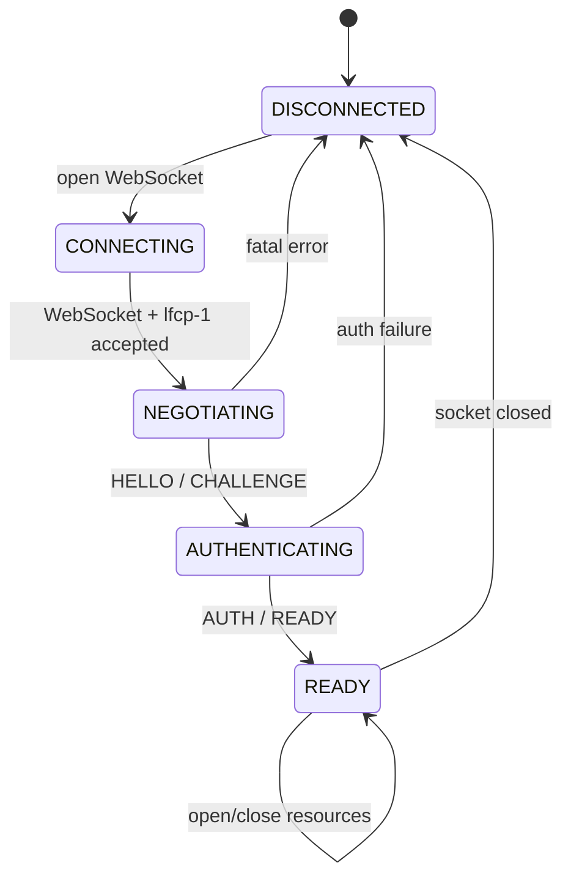

The application may continue local offline editing while the network state is `DISCONNECTED`.

---

## 64. Server session state machine

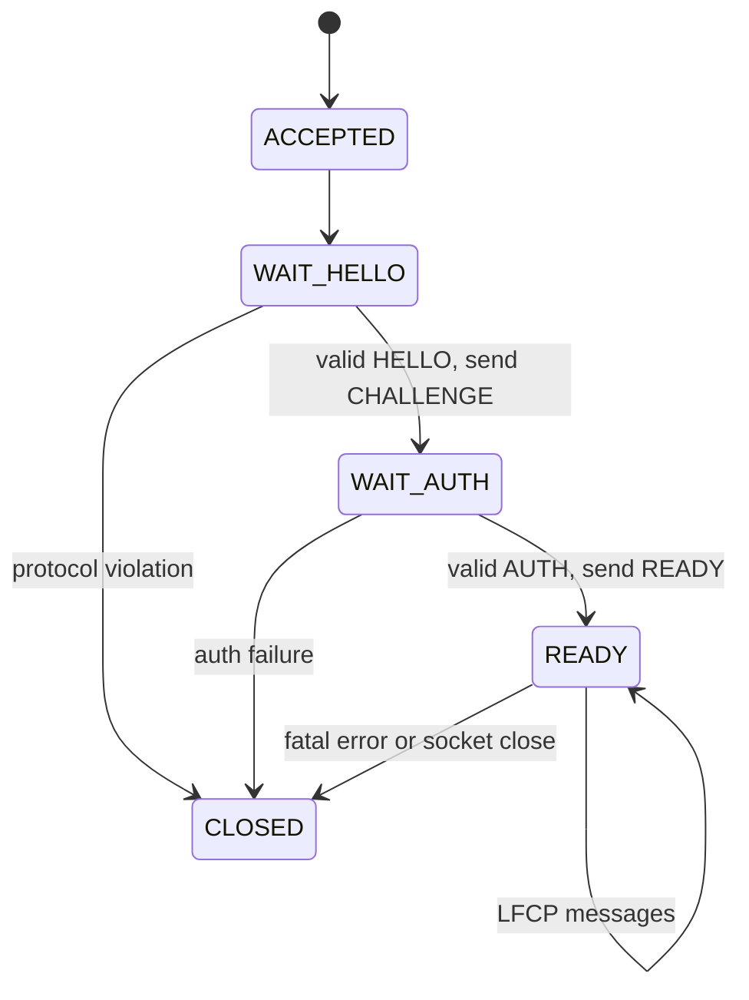

Before `READY`, a server MUST reject Resource, Control, Data, Key and Snapshot messages.

---

## 65. Per-resource client sync state machine

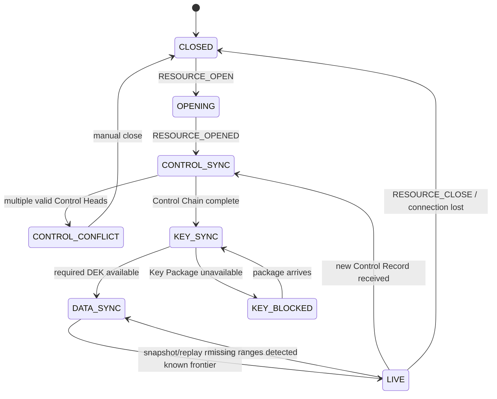

A local Resource replica remains available to the application even if network sync is not `LIVE`.

---

# Part XVII. Synchronization Algorithm

## 66. Initial synchronization

After `RESOURCE_OPENED`, the client SHOULD synchronize in this order:

1. Control Plane;
2. required Key Packages;
3. preferred Snapshot, if useful;
4. Data Plane ranges after the Snapshot frontier;
5. live subscription.

This order prevents the client from attempting to interpret encrypted data before it knows the current authorization and encryption state.

---

## 67. Control synchronization

Suppose the client has Control Sequence `10` and the server has `14`.

```text
client -> CONTROL_GET(resource, 11, 14)
server -> CONTROL_BATCH(C11, C12, C13, C14)
```

The client verifies every signature and transition.

If the server presents two records at the same sequence that descend from the same head, the client enters `CONTROL_CONFLICT`.

---

## 68. Data synchronization

Both peers exchange Have Vectors.

Example:

```text
Client:
A 1..100
B 1..40

Server:
A 1..104
B 1..40
C 1..8
```

Client requests:

```text
A 101..104
C 1..8
```

The peer returns `DATA_BATCH` messages.

The receiver:

1. hashes exact object bytes;
2. deduplicates;
3. verifies signature;
4. verifies actor sequence/hash chain;
5. verifies authorization at `control_ref`;
6. validates epoch/cutoff;
7. decrypts;
8. passes plaintext to the Data Profile;
9. updates local Have Vector;
10. persists before advertising possession to other peers.

---

## 69. Live replication

When a session has live Data Plane subscription enabled, a server SHOULD push newly accepted Data Units to subscribed sessions.

A client MUST still periodically exchange `DATA_HAVE` because push delivery is not guaranteed.

LFCP uses anti-entropy, not push delivery, as the convergence mechanism.

---

## 70. At-least-once delivery

All persistent object delivery is at-least-once.

Duplicate messages are expected.

All persistent LFCP objects are immutable and content-addressed, so receiving the same exact object multiple times is harmless.

Exactly-once network delivery is neither required nor assumed.

---

# Part XVIII. Sequence Diagrams

## 71. Create and host a Resource

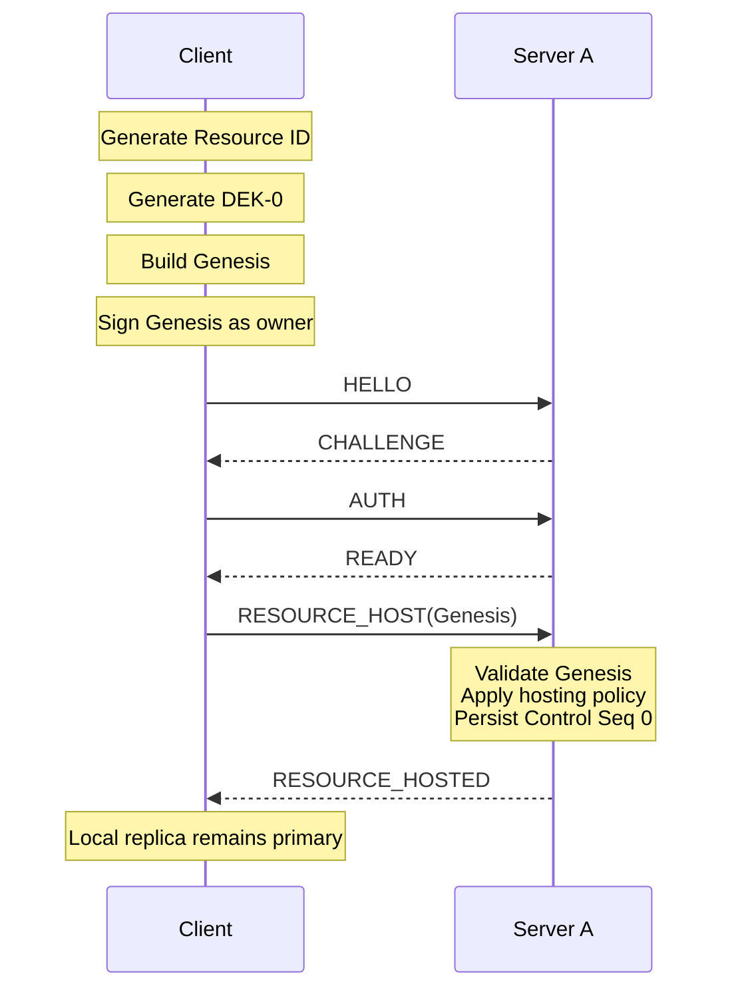

The server does not receive DEK-0 in plaintext.

---

## 72. Targeted invitation

Assume Alice already knows Bob's Principal Descriptor.

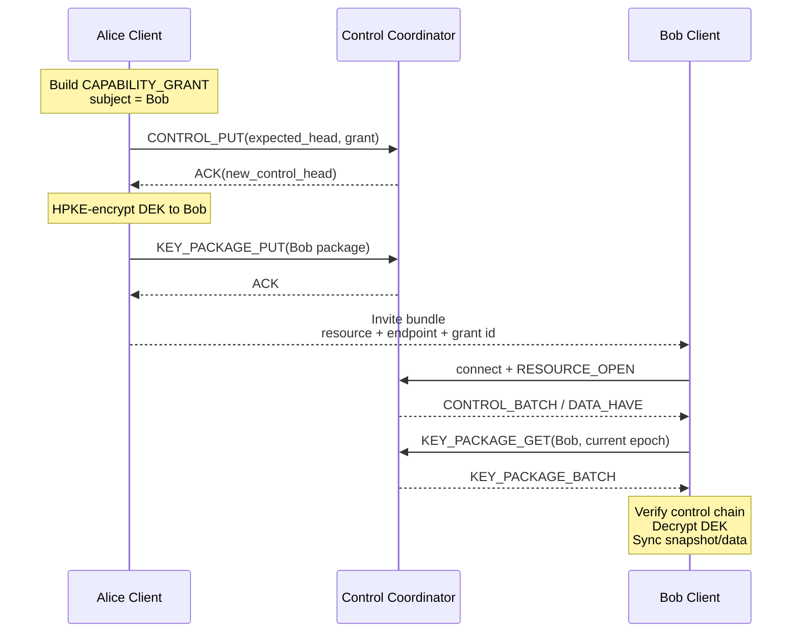

The invite bundle itself does not need to contain the DEK.

---

## 73. Link invitation and one-time claim

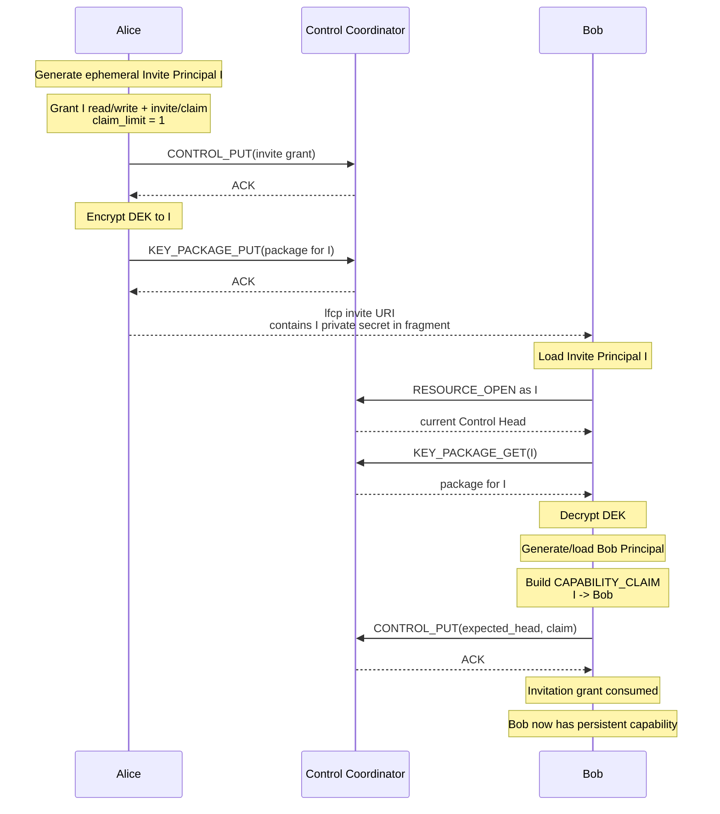

A second claim receives `CONTROL_HEAD_MISMATCH`, refreshes, and then fails validation because the invitation claim has already been consumed.

---

## 74. Offline collaborative sync

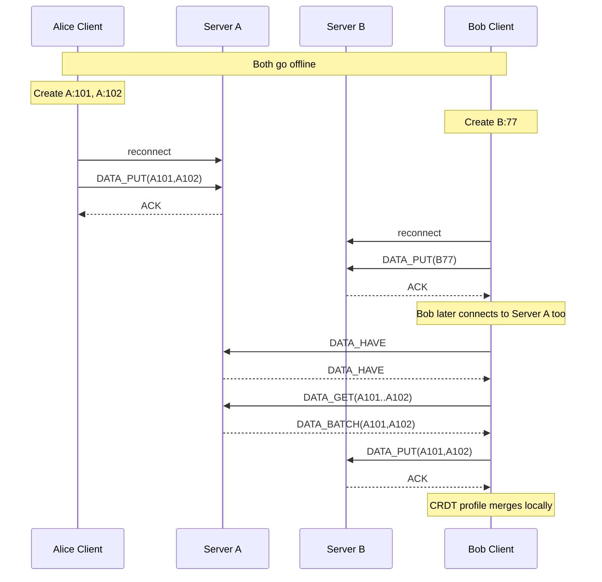

Servers A and B never needed direct federation for convergence; Bob acted as a carrier.

---

## 75. Security revocation and key rotation

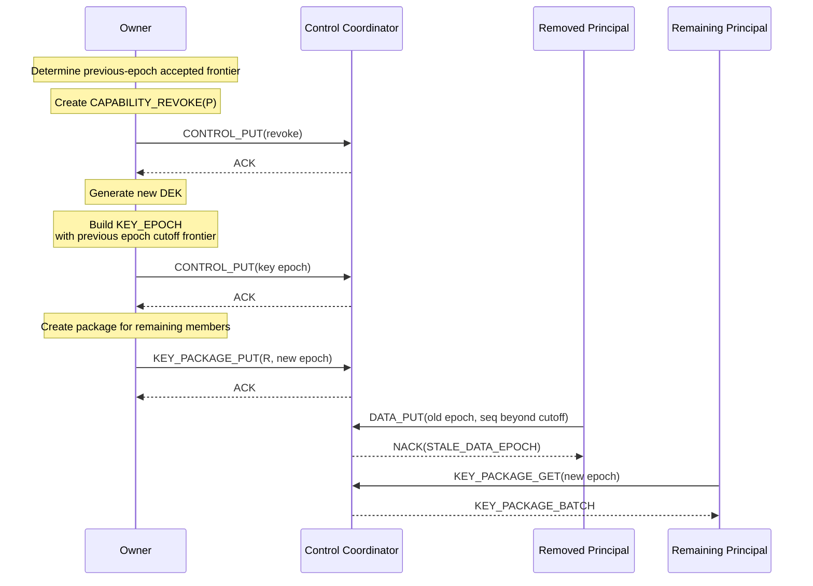

The removed Principal can still decrypt historical data already available under old keys.

---

## 76. Ownership transfer

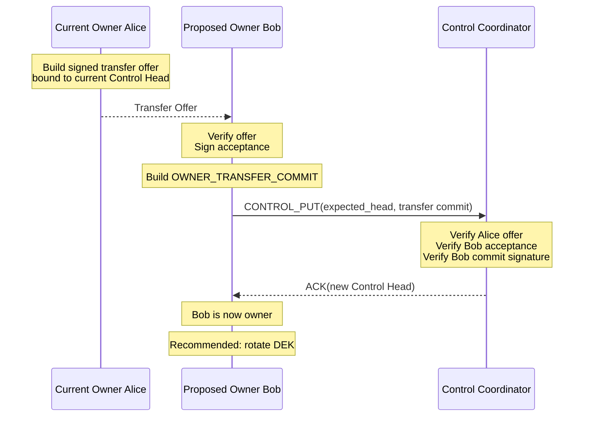

Alice does not need to remain online after sending the signed offer.

---

## 77. Normal server migration

Initial state:

```text
Control Coordinator = Server A
Routes = [Server A]
```

Migration to Server B:

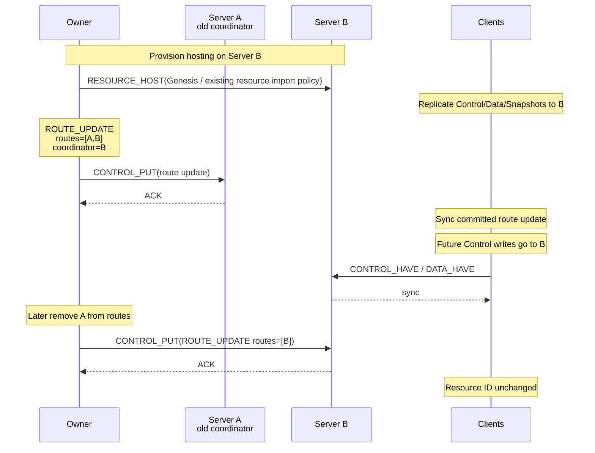

The old server did not transfer ownership. It only stopped being a route.

---

## 78. Dead coordinator recovery

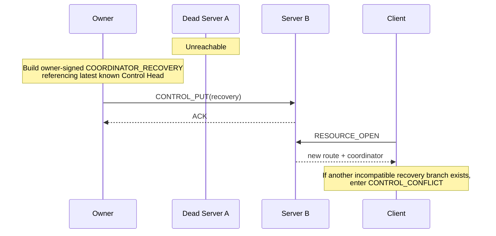

This mechanism prefers recoverability but cannot prevent all forks under arbitrary network partition.

---

# Part XIX. Control Validation

## 79. Required Control Chain state

A validator SHOULD derive at least:

```text
owner
current control head
current control sequence
current route version
current endpoints
current Control Coordinator
current Data Epoch
DEK commitment per epoch
active capability grants
consumed invite claims
revocations
tombstone state
```

This derived state is local and reproducible from Genesis plus the valid Control Chain.

---

## 80. Capability evaluation

To decide whether Principal `P` has ability `X` at Control Head `H`:

1. reconstruct Control Chain through `H`;
2. if `P` is the owner at `H`, return true;
3. find active grants whose subject is `P` and which include `X`;
4. recursively validate each grant's parent/delegation chain if present;
5. ensure no required parent grant was revoked before or at `H`;
6. ensure invite claims and claim limits are respected;
7. return true if at least one valid chain exists.

A client MUST evaluate authorization at the Data Unit's referenced `control_ref`, then apply any later epoch cutoff rules.

---

## 81. Stale Control Head writes

A writer may create Data Units while offline using an older Control Head.

That is permitted if the writer was authorized at that head and the epoch remains acceptable under later cutoff rules.

Control Plane writes are different: ordinary `CONTROL_PUT` MUST target the current Control Head at the coordinator.

This asymmetry is intentional.

---

# Part XX. Server Behavior

## 82. Minimal server storage model

A minimal implementation can use roughly these logical stores:

```text
resources
  resource_id
  genesis
  current_control_heads
  hosting_metadata

control_records
  resource_id
  control_seq
  record_id
  cose_bytes

units
  resource_id
  actor_id
  seq
  unit_id
  epoch
  cose_bytes

key_packages
  resource_id
  epoch
  recipient_id
  package_id
  cose_bytes

snapshots
  resource_id
  snapshot_id
  epoch
  cose_bytes
```

A SQLite-backed server is sufficient for the reference implementation.

Application-level plaintext tables are neither required nor recommended.

---

## 83. Server deduplication

Servers MUST deduplicate persistent objects by object ID.

For Data Units, servers SHOULD additionally index:

```text
(resource_id, actor_id, seq)
```

If a second different Data Unit appears for the same tuple, the server SHOULD preserve enough evidence to report actor equivocation rather than silently overwriting the first object.

---

## 84. Server-side authorization

Servers SHOULD enforce enough authorization to prevent obvious abuse, but clients remain authoritative verifiers.

Recommended server checks:

- session Principal proof;
- resource hosting policy;
- capability proof for writes;
- current Control Head for Control Plane changes;
- current coordinator role;
- quotas;
- rate limits;
- message limits.

A server MAY allow read access to encrypted Data Plane objects more broadly than clients would, because ciphertext remains end-to-end encrypted, but this leaks metadata and consumes bandwidth. Production deployments SHOULD enforce read authorization.

---

## 85. Server federation

No special server-to-server protocol is required for basic LFCP federation.

A server may connect to another server as a replication peer and use the same:

```text
RESOURCE_OPEN
CONTROL_HAVE
CONTROL_GET
DATA_HAVE
DATA_GET
KEY_PACKAGE_GET
SNAPSHOT_GET
```

messages.

Server-specific mirror credentials are hosting policy and are outside Resource authorization.

---

# Part XXI. Client Behavior

## 86. Required local persistence

A conforming local-first client MUST persist at least:

- Principal private keys or secure references to them;
- Resource Genesis;
- Control Chain records;
- Route cache;
- DEKs for authorized epochs;
- local Data Units not yet acknowledged by any route;
- received Data Units required to reconstruct local state or a safe compacted equivalent;
- actor sequence counters;
- CRDT/profile state or enough data to reconstruct it.

A client MUST persist its next actor sequence safely before exposing a newly created Data Unit as committed local work.

---

## 87. Offline write procedure

When the application produces a new profile payload while offline:

1. load current local Control Head;
2. ensure local Principal currently appears authorized for `data/write`;
3. load current local Data Epoch and DEK;
4. reserve and persist the next actor sequence;
5. construct AAD;
6. encrypt profile plaintext;
7. construct Data Unit payload;
8. sign with Principal Ed25519 key;
9. persist exact COSE bytes locally;
10. apply plaintext to the local profile state;
11. enqueue the Data Unit for replication.

The local application MUST NOT wait for server ACK before showing the local edit.

---

## 88. Reconnect procedure

On reconnect:

1. establish LFCP session;
2. open each active Resource;
3. synchronize Control Plane first;
4. process new revocations and epochs;
5. obtain missing Key Packages;
6. upload locally queued valid Data Units;
7. quarantine units invalidated by a strict epoch cutoff;
8. synchronize remote Data Units;
9. converge the Data Profile;
10. resume live anti-entropy.

---

# Part XXII. Route Hints and Host Documents

## 89. Route hints are non-authoritative

Applications such as Obsidian may store a Resource ID in Markdown and keep routes in local plugin state.

Example host document:

```yaml
---
collab:
  resource: "lfcp:<textual-resource-id>"
---
```

A local route cache might contain:

```json
{
  "lfcp:<resource-id>": [
    "wss://sync.example.org/v1/ws"
  ]
}
```

A host document MAY include a bootstrap route hint, but the hint MUST NOT override a newer valid `ROUTE_UPDATE` in the Control Chain.

This allows server migration without rewriting every local Markdown file.

---

## 90. Embedded shared objects

LFCP-WIRE-01 places no requirement that one host file map to one Resource.

A private Markdown file may reference many Resources:

```md
# Private launch notes

This paragraph is private.

- [ ] Backend API ^lfcp:task:8A72

Another private paragraph.

{{lfcp:decision:pricing-2026}}
```

The editor adapter may route each embedded Resource independently.

This is an application-layer feature and requires no Wire Protocol change.

---

# Part XXIII. Hosted Accounts and Self-Hosted Registration

## 91. Server accounts are not LFCP identities

A synchronization provider may have conventional accounts for:

- billing;
- quota management;
- anti-abuse;
- push notifications;
- server administration;
- organization management.

These accounts MUST NOT redefine Resource ownership.

A provider may map:

```text
hosting account 12345
      |
      +-- allowed Principal IDs
```

but Resource Control Plane authority remains cryptographic and portable.

---

## 92. Recommended self-hosted bootstrap

The reference server SHOULD avoid a mandatory email/password registration flow.

Recommended first-run behavior:

```text
1. Generate server_id and local admin bootstrap secret.
2. Print a one-time setup URL/code to stdout.
3. User opens /setup locally or over TLS.
4. User pairs one LFCP Principal as server administrator.
5. Bootstrap secret is destroyed.
6. Future administration authenticates with the paired Principal.
```

This UI is server administration, not part of LFCP Resource trust.

The Wire Protocol therefore does not define a `REGISTER_USER` message.

---

# Part XXIV. Security Considerations

## 93. Untrusted server

LFCP protects against a server attempting to:

- alter signed persistent records;
- forge another Principal;
- silently replace ownership;
- silently change routes;
- read properly encrypted Data Plane plaintext;
- substitute a different DEK without detection.

Clients detect these failures through signatures, Control Chain validation and DEK commitments.

---

## 94. What a malicious server can still do

A malicious server can:

- deny service;
- delay updates;
- omit updates;
- return stale but previously valid data;
- observe IP addresses;
- observe Resource IDs hosted on that server;
- observe message timing and sizes;
- observe approximate collaborator activity;
- delete its own copy of data.

Multi-route replication improves availability but does not provide anonymity.

---

## 95. Authorized readers can copy plaintext

No protocol can force a previously authorized user to forget plaintext they already received.

Revocation protects future access after a new key epoch; it does not retroactively erase knowledge.

---

## 96. Clock independence

LFCP-WIRE-01 deliberately avoids making core authorization depend on wall-clock time.

Time-based invitation expiration and account session expiration MAY be enforced by servers as policy, but the cryptographic Resource state is ordered by Control Sequence rather than timestamps.

This avoids making offline authorization correctness depend on synchronized clocks.

---

## 97. Replay

Persistent objects are immutable and content-addressed.

Replaying an exact valid object is harmless after deduplication.

Replaying an obsolete Control Record does not move the Control Head backward because Control Records are accepted only when they extend the expected current head.

---

## 98. Principal private key compromise

If a write Principal is compromised:

1. revoke its capability;
2. rotate the Data Epoch;
3. define the old epoch cutoff frontier;
4. issue new Key Packages only to remaining authorized Principals.

If the current owner Principal is compromised, WIRE-01 does not provide a universal trustless recovery mechanism.

Owner recovery is intentionally deferred to a future threshold/recovery extension.

Implementations SHOULD encourage backup or hardware protection for owner keys.

---

# Part XXV. Conformance

## 99. Minimal LFCP-WIRE-01 server

A conforming minimal server MUST implement:

- WebSocket `lfcp-1` handshake;
- HELLO / CHALLENGE / AUTH / READY;
- Resource hosting;
- Resource open/close;
- Control Plane storage and range retrieval;
- Control Coordinator CAS for `CONTROL_PUT`;
- Data Plane Have/Get/Put;
- Key Package Get/Put;
- Snapshot Get/Put;
- durable object IDs;
- deduplication;
- error codes;
- persistent storage.

Presence is OPTIONAL.

A conforming server does **not** need:

- Automerge;
- Yjs;
- Markdown parsing;
- task semantics;
- user-facing document UI;
- global accounts;
- plaintext access.

---

## 100. Minimal LFCP-WIRE-01 client

A conforming client MUST implement:

- Principal key generation and storage;
- deterministic Principal IDs;
- LFCP session handshake;
- Genesis validation;
- Control Chain validation;
- capability evaluation;
- owner transfer validation;
- route handling;
- Data Epoch handling;
- HPKE Key Package processing;
- Data Unit encryption/signing;
- Data Unit verification/decryption;
- local actor sequence persistence;
- Have Vector synchronization;
- at least one LFCP Data Profile;
- offline local writes;
- reconnect synchronization;
- stale epoch quarantine.

---

# Part XXVI. Reference Implementation Shape

## 101. Suggested repository layout

```text
lfcp/
  spec/
    LFCP-PROTOCOL.md
    LFCP-WIRE-01.md

  packages/
    core/
      ids
      cbor
      cose
      crypto
      control
      capabilities
      routing
      keys
      wire

    client/
      local-store
      sync-engine
      route-manager

    profile-automerge/
    profile-yjs/

  server/
    websocket
    sqlite-store
    control-coordinator
    admin-ui

  integrations/
    obsidian/
    vscode/
```

The Obsidian and VS Code integrations SHOULD depend on the same LFCP client library.

---

## 102. Suggested first reference server

The first server SHOULD be deliberately boring:

```text
single process
single Docker image
SQLite
WebSocket
small administration UI
no external Redis
no external Postgres
```

Logical architecture:

```text
             +-----------------------+
             |      WebSocket        |
             +-----------+-----------+
                         |
             +-----------v-----------+
             | Session authentication|
             +-----------+-----------+
                         |
             +-----------v-----------+
             | Resource subscriptions|
             +-----+-----------+-----+
                   |           |
          +--------v--+     +--v---------+
          | Control   |     | Data Plane |
          | Coordinator|    | Anti-entropy|
          +--------+--+     +--+---------+
                   |           |
             +-----v-----------v-----+
             |       SQLite          |
             +-----------------------+
```

---

# Part XXVII. Implementation Notes for Obsidian and VS Code

## 103. Obsidian

The Obsidian plugin can map:

```text
Markdown host document
        |
        +-- whole-document LFCP Resource
        |
        +-- embedded task Resource
        |
        +-- embedded decision Resource
```

A plugin-local database stores:

```text
resource id -> routes
resource id -> local replica state
resource id -> DEKs
resource id -> pending Data Units
```

The `.md` file only needs stable LFCP references.

---

## 104. VS Code

A VS Code extension can reuse:

- Principal management;
- route cache;
- key storage;
- control validation;
- WebSocket sync;
- Automerge/Yjs profile adapters.

Only the presentation and editor binding need to differ.

This is why editor semantics MUST remain outside LFCP-WIRE-01.

---

# Part XXVIII. Full CDDL Summary

The following is a compact collection of the principal WIRE-01 structures. COSE internals are defined by the COSE standards; LFCP transmits exact COSE object bytes as `bstr`.

```cddl
resource-id = bstr .size 32
principal-id = bstr .size 32
hash32 = bstr .size 32

principal-descriptor = {
  0 => principal-id,
  1 => bstr .size 32,         ; Ed25519 public key
  2 => bstr .size 32          ; X25519 public key
}

endpoint = {
  0 => tstr,
  1 => uint,
  ? 2 => uint
}

control-head = {
  0 => uint,
  1 => hash32
}

sequence-range = [uint, uint]

actor-have = {
  0 => principal-id,
  1 => uint,
  ? 2 => [* sequence-range]
}

lfcp-message = {
  0 => uint,
  1 => bstr .size 16,
  ? 2 => bstr .size 16,
  ? 3 => uint,
  4 => any
}

control-record-payload = {
  0 => resource-id,
  1 => uint,
  2 => (hash32 / null),
  3 => uint,
  4 => principal-id,
  5 => any
}

genesis-body = {
  0 => tstr,
  1 => principal-descriptor,
  2 => hash32,
  3 => [1* endpoint],
  4 => tstr
}

capability-grant-body = {
  0 => principal-descriptor,
  1 => [1* uint],
  2 => [* uint],
  ? 3 => hash32,
  ? 4 => uint
}

capability-revoke-body = {
  0 => hash32
}

capability-claim-body = {
  0 => hash32,
  1 => principal-descriptor,
  2 => [1* uint]
}

key-epoch-body = {
  0 => uint,
  1 => hash32,
  2 => [* actor-have],
  3 => uint
}

route-update-body = {
  0 => uint,
  1 => [1* endpoint],
  2 => tstr
}

coordinator-recovery-body = {
  0 => uint,
  1 => [1* endpoint],
  2 => tstr,
  3 => tstr
}

owner-transfer-offer-payload = {
  0 => resource-id,
  1 => hash32,
  2 => uint,
  3 => principal-descriptor,
  4 => bstr .size 16
}

owner-transfer-accept-payload = {
  0 => resource-id,
  1 => hash32,
  2 => principal-id
}

owner-transfer-commit-body = {
  0 => bstr,
  1 => bstr
}

resource-tombstone-body = {
  0 => uint,
  ? 1 => tstr
}

key-package-payload = {
  0 => resource-id,
  1 => uint,
  2 => principal-id,
  3 => hash32,
  4 => principal-id,
  5 => bstr,
  6 => bstr
}

data-unit-payload = {
  0 => resource-id,
  1 => uint,
  2 => principal-id,
  3 => uint,
  4 => (hash32 / null),
  5 => hash32,
  6 => bstr
}

snapshot-payload = {
  0 => resource-id,
  1 => uint,
  2 => principal-id,
  3 => uint,
  4 => hash32,
  5 => [* actor-have],
  6 => bstr
}
```

---

# Part XXIX. Interoperability Rules

## 105. What two independent implementations must agree on

Two independent LFCP-WIRE-01 implementations are interoperable only if they agree on all of the following:

1. exact Principal ID derivation;
2. exact Resource ID size;
3. deterministic CBOR encoding;
4. exact COSE signature rules;
5. object ID hashing;
6. Data Unit AAD construction;
7. actor-key HKDF derivation;
8. Data Unit nonce construction;
9. DEK commitment construction;
10. HPKE suite and context construction;
11. Control Record type codes;
12. ability codes;
13. message type codes;
14. error codes;
15. Control Chain validation;
16. invitation claim semantics;
17. Key Epoch cutoff semantics;
18. ownership transfer validation;
19. Route Update semantics;
20. Have Vector normalization.

These items MUST have machine-readable test vectors before LFCP-WIRE-01 is promoted from Working Draft to Release Candidate.

---

# Part XXX. Required Test Vectors Before Release Candidate

## 106. Cryptographic vectors

The reference repository MUST publish deterministic vectors for:

- Principal ID derivation;
- Genesis signing and object ID;
- Capability Grant signing;
- Data Unit actor-key derivation;
- Data Unit AAD;
- ChaCha20-Poly1305 ciphertext;
- Data Unit COSE signature;
- Data Unit ID;
- HPKE Key Package encryption/decryption;
- DEK commitment verification;
- Snapshot encryption/signing;
- ownership transfer offer/accept/commit.

Each vector SHOULD include:

```text
input fields
canonical CBOR hex
COSE protected header hex
signature hex
final object hex
SHA-256 object id
expected validation result
```

---

## 107. State-machine vectors

The repository MUST also include non-cryptographic interoperability fixtures for:

- normal Control Chain;
- stale `CONTROL_PUT`;
- Control Fork detection;
- successful invite claim;
- second invite claim rejection;
- valid old offline Data Unit;
- old-epoch Data Unit beyond cutoff;
- actor sequence gap;
- actor equivocation;
- normal ownership transfer;
- server migration;
- coordinator recovery fork detection.

---

# Part XXXI. Deferred Work

## 108. Deliberately deferred from WIRE-01

The following features are intentionally deferred rather than underspecified:

### 108.1 Multi-device root identity

A future extension may define:

```text
Human Root Identity
    |
    +-- Device Principal A
    +-- Device Principal B
    +-- Device Principal C
```

including device revocation and recovery.

### 108.2 Multi-owner governance

Possible future models:

- N-of-M signatures;
- organization policy keys;
- threshold cryptography;
- administrator quorums.

### 108.3 MLS group key management

Large groups may benefit from an MLS-based key-management profile rather than per-recipient HPKE Key Packages.

### 108.4 Attachments

Large binary blobs require separate chunking, hashing, caching and garbage-collection semantics.

### 108.5 Public identity discovery

Human-readable handles such as:

```text
alice@example.org
@alice
alice.dev
```

may resolve to Principal Descriptors through optional discovery protocols.

They are not necessary for LFCP Resource interoperability.

### 108.6 Privacy transport

Metadata-hiding relay layers, onion routing and private information retrieval are out of scope for WIRE-01.

---

# Part XXXII. Reference End-to-End Flow

## 109. Complete happy path

A complete small deployment can operate as follows:

```text
1. Alice's Obsidian plugin generates:
   - Alice Principal
   - Resource ID
   - DEK-0
   - Genesis

2. Alice hosts the Resource on sync.alice.example.

3. Alice edits locally.
   Plugin creates encrypted signed Data Units.

4. Alice invites Bob with a link.
   Link carries an ephemeral Invitation Principal secret.

5. Bob opens the link in his client.
   He downloads Control state and the invite Key Package.

6. Bob generates his normal Principal.
   He atomically claims the invitation at the Control Coordinator.

7. Bob and Alice edit offline independently.

8. Their clients reconnect, exchange Have Vectors and Data Units.

9. Automerge/Yjs/profile logic merges plaintext locally.

10. Alice later adds sync.company.example as another route.

11. Data is copied to the new route by ordinary anti-entropy.

12. Alice commits a Route Update making the company server the new
    Control Coordinator.

13. Later Alice transfers ownership to Bob.

14. Bob rotates the DEK if Alice should lose future access.

15. Bob removes the old server from the Route Manifest.

Throughout the entire process:

- the Resource ID remains unchanged;
- the Markdown path is irrelevant to the protocol;
- no global LFCP account is required;
- no server needs to understand the Resource plaintext;
- a local replica remains usable offline.
```

---

# Part XXXIII. Core Principle

## 110. Final invariant

LFCP-WIRE-01 is built around one architectural statement:

> **The network transports and coordinates replicas; it does not define who owns the data.**

The Resource remains identifiable and usable independently of any single server, editor, account provider or storage location.

That property is the reason the protocol exists.

---

# Appendix A. Reference server admin UI, non-normative

A minimal self-hosted server UI probably needs only four screens.

## A.1 First run

```text
LFCP Server

This server has not been initialized.

Bootstrap code:
H7KM-29QF-JW82

[ Pair LFCP Principal ]
```

## A.2 Server settings

```text
Server name
Public WebSocket URL
Storage directory
Hosting mode:
  Private
  Invite-only
  Public
Default quota
Maximum Resource size
```

## A.3 Administrators

```text
Paired admin Principals

Principal                Added
lfcp:principal:...        2026-10-03

[ Add administrator ]
[ Remove ]
```

## A.4 Storage

```text
Resources       42
Data Units      182,914
Snapshots       316
Disk used       1.8 GB

[ Compact ]
[ Export diagnostics ]
```

The administration UI does not need to display or decrypt collaborative Resource contents.

---

# Appendix B. Suggested next implementation milestone, non-normative

The first interoperability milestone should be extremely small:

```text
Client A
    |
    | LFCP-WIRE-01
    v
Server A (SQLite)
    |
    +--------------------+
                         |
Client B                 |
    |                    |
    +--> Server B -------+
```

Demonstrate all of the following:

1. create Resource on Server A;
2. invite Client B;
3. Client B claims invite;
4. both clients edit offline;
5. reconnect through different servers;
6. client-mediated anti-entropy converges both servers;
7. revoke a writer and rotate the Data Epoch;
8. transfer ownership;
9. migrate the Control Coordinator from A to B;
10. delete Server A and continue using the same Resource ID.

If that experiment works with two independently written clients, LFCP has crossed the line from architecture idea to interoperable protocol.
